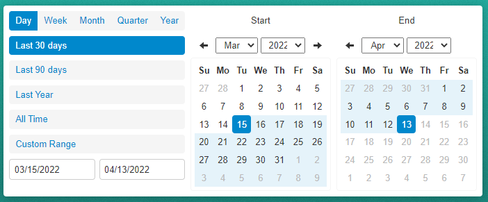

# perioddaterangepicker

<p align="center">
  
</p>

<!-- badges: start -->
[](https://lifecycle.r-lib.org/articles/stages.html)
[](https://github.com/trafficonese/perioddaterangepicker/actions)
[](https://app.codecov.io/gh/trafficonese/perioddaterangepicker?branch=main)
<!-- badges: end -->

Custom Shiny input binding for a [Date Range Picker](https://sensortower.github.io/daterangepicker/).

## Installation
``` r
# install.packages("remotes")
remotes::install_github("trafficonese/perioddaterangepicker")
```

## Example

A basic example of a Date Range Picker:

``` r
library(shiny)
library(perioddaterangepicker)

## UI ##########################
ui <- fluidPage(
  perioddaterangepicker(
    inputId = "daterange",
    label = "Pick a Date",
    start = Sys.Date() - 30, end = Sys.Date(),
    style = "width:100%; border-radius:4px",
    icon = icon("calendar")
  ),
  verbatimTextOutput("print")
)

## SERVER ##########################
server <- function(input, output, session) {
  output$print <- renderPrint({
    req(input$daterange)
    input$daterange
  })
}

shinyApp(ui, server)
```

Further examples are in [/inst/examples/](https://github.com/trafficonese/perioddaterangepicker/tree/master/inst/examples)
